#  CoCai

[](https://github.com/psf/black)
[](https://github.com/pre-commit/pre-commit)

A chatbot that plays Call of Cthulhu (CoC) with you, powered by AI.


_(Logo by [@Norod78](https://linktr.ee/Norod78), originally [published on Civitai](https://civitai.com/images/1231343))_

## Usage

### Pre-requisites

Install [Ollama](https://ollama.com/download), a local server that runs large language models (LLMs). This chatbot uses Ollama to generate text. If you prefer to use more powerful LLMs, you can edit the code.

Ensure that your local Ollama server has already downloaded the `qwen2:7b` model. If you haven't (or aren't sure), run the following command:

```shell
ollama pull qwen2:7b
```

Install [`just`](https://github.com/casey/just), a command runner. I use this because I always tend to forget the exact command to run.

Written in Python, this project uses the Rust-based package manager [`uv`](https://docs.astral.sh/uv/). It does not require you to explicitly create a virtual environment.

**Prepare a CoC module**. Unsure which to pick? Start with [_“Clean Up, Aisle Four!”_][a4] by [Dr. Michael C. LaBossiere][mc].
You'll need it in Markdown format, though. If you can only find the PDF edition, you can:
1. upload it to Google Drive,
2. open it with Google Docs,
3. download it as Markdown, and finally
4. do some cleanings.

[a4]: https://shadowsofmaine.wordpress.com/wp-content/uploads/2008/03/cleanup.pdf
[mc]: https://lovecraft.fandom.com/wiki/Michael_LaBossiere

### Running the Chatbot

You can start the chatbot by running:

```shell
just serve
```

## Design

A typical game of CoC involves a Keeper (the game master) and Investigators (the players). The Keeper narrates the story, and the Investigators interact with the world. The Keeper also plays the roles of the non-player characters (NPCs).

How does a Keeper know how the story should unfold? That's where **CoC modules** come in. A _module_ is a scenario that the Keeper uses to run a game. It contains the story, the NPCs, and the challenges that the Investigators face.

Yes, **challenges**. CoC is a horror game, and the Investigators will face many challenges. These challenges can be anything from a locked door to a monster from another dimension. To determine the outcome of these challenges, the Keeper and the Investigators roll dice. If fortune bestows upon them, they succeed and progress the story. If not, they face the consequences, and the story takes a darker turn.

Here's a flowchart of a typical CoC game:

```mermaid
graph TD
    A([Game starts]) --> B["`Each player creates a character (optional)`"]
    B --> C[Keeper sets up the story background]
    C --> D["`Keeper describes the current situation`"]
    subgraph a [main loop]
        D --> E[Encounters and Challenges]
        E --> F{Roll dices}
        F --> |Success| G[Advance the Story]
        F --> |Failure| H[Consequences]
        G --> |Game continues| D
        H --> D
    end
    G --> |Game ends| I[Final Confrontation & Resolution]
    I --> J([Game ends])
```



**Character building** is a process that involves quite some math, which isn't LLM's strong suit. Fortunately, some CoC Modules have preset characters for the Investigators. Even if they didn't, there are [generic, pre-built characters](https://www.dholeshouse.org/CharacterLibrary/CoC7edInvestigators) you can bring to the game. In this sense, I consider "character creation" optional. For the sake of simplicity, let's omit character-building capabilities from this chatbot.
