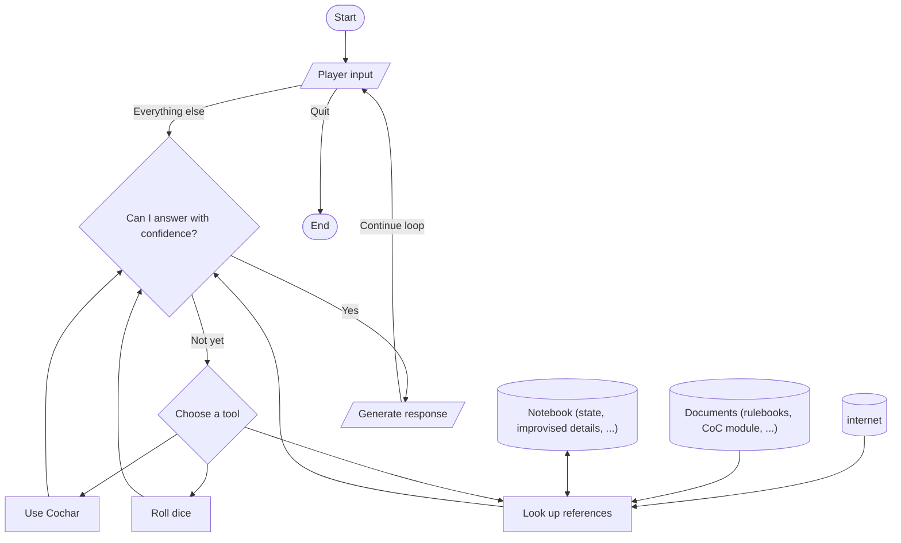

#  CoCai

[](https://github.com/psf/black)
[](https://github.com/pre-commit/pre-commit)

A chatbot that plays Call of Cthulhu (CoC) with you, powered by AI.


_(Logo by [@Norod78](https://linktr.ee/Norod78), originally [published on Civitai](https://civitai.com/images/1231343))_

## Demo

Check out this transcript:


In the first message, I asked Cocai to generate a character for me:

> Can you generate a character for me? Let's call him "Don Joe". Describe what kind of guy he is, then tabulate his stats.

Under the hood, Cocai used [Cochar](https://www.cochar.pl/). In the first couple of attempts, Cocai forgot to provide some required parameters. Cocai fixed that problem and successfully generated a character profile from Cochar.

Then, I asked Cocai what I -- playing the character of Mr. Don Joe -- can do, being stuck in a dark cave. It suggested a couple of options and described the potential outcomes associated with each choice.

I then asked Cocai to roll a skill check for me, Spot Hidden. Based on the chat history, Cocai was able to recall that Mr. Joe had a Spot Hidden skill of 85%. It rolled the dice, got a successful outcome, and took some inspiration from its 2nd response to progress the story.

Thanks to the chain-of-thought (CoT) visualization feature, you can unfold the tool-using steps and verify yourself that Cocai was indeed able to recall the precise value of Joe's Spot Hidden skill:


## Usage

### Pre-requisites

Bring your own large language model (LLM).
- The easiest (and perhaps highest-quality) way would be to provide an API key to OpenAI. Simply add `OPENAI_API_KEY=sk-...` to a `.env` file in the project root.
- With the absence of an OpenAI API key, the chatbot will default to using [Ollama](https://ollama.com/download), a program that serves LLMs locally.
  - Ensure that your local Ollama server has already downloaded the `llama3.1` model. If you haven't (or aren't sure), run `ollama pull llama3.1`.
  - If you want to use a different model that does not support function-calling, that's also possible. Revert [this commit][tc], so that you can use the ReAct paradigm to simulate function-calling capabilities with a purely semantic approach.

[tc]: https://github.com/StarsRail/Cocai/commit/13d777767d1dd96024021c085247525ec52b79ba

Install [`just`](https://github.com/casey/just), a command runner. I use this because I always tend to forget the exact command to run.

Written in Python, this project uses the Rust-based package manager [`uv`](https://docs.astral.sh/uv/). It does not require you to explicitly create a virtual environment.

**Prepare a CoC module**. Unsure which to pick? Start with [_“Clean Up, Aisle Four!”_][a4] by [Dr. Michael C. LaBossiere][mc].
You'll need it in Markdown format, though. If you can only find the PDF edition, you can:
1. upload it to Google Drive,
2. open it with Google Docs,
3. download it as Markdown, and finally
4. do some cleanings.

[a4]: https://shadowsofmaine.wordpress.com/wp-content/uploads/2008/03/cleanup.pdf
[mc]: https://lovecraft.fandom.com/wiki/Michael_LaBossiere

### Running the Chatbot

You can start the chatbot by running:

```shell
just serve
```

# Let's write an AI Keeper for _Call of Cthulhu_!

## Introduction

**Call of Cthulhu** (CoC) is a tabletop role-playing game based on the works of H.P. Lovecraft. It involves 3~8 players, but coordinating everyone's schedule can feel like trying to align the stars. What if you're all alone and suddenly start to crave for a game? That's where an AI Keeper comes in. It can run a game for you, anytime, anywhere.

In this post, we'll build a chatbot that acts as the game master ("Keeper") in a single-player CoC game. It will narrate the story, play the NPCs, and roll the dices. This means:

- **We'll use large language models (LLMs).** As a narrative-driven game, CoC involves lots of natural-language interactions. Often, the game master ("Keeper" in the CoC world) has to improvise the story based on the players' actions, which demands latent knowledge and common sense. This is where LLMs shine.
- **The chatbot will be agentic.** As the Keeper, our AI needs to consult the rulebook, roll dices, and examine player statuses. Each of those capabilities can be delegated to a "tool" that the AI can use. The ability to use tools, in this context, is called "having agency".
- **We'll use retrival-augmented generation (RAG).** While hosting the game, the AI Keeper often need to look up rules, consult playbooks, and even searching the internet for facts. We can't possibly train an LLM on all that knowledge (or guarantee its accuracy in recalling anything). Instead, we'll have the AI agent retrieve data on-demand. See [_Why RAG is Big_][wr].

Are you looking for real-world examples of building AI applications? This project is a great starting point. Let's dive in!

## Background

A typical game of CoC involves a Keeper (the game master) and Investigators (the players). The Keeper narrates the story, and the Investigators interact with the world. The Keeper also plays the roles of the non-player characters (NPCs).

How does a Keeper know how the story should unfold? That's where **CoC modules** come in. A _module_ is a scenario that the Keeper uses to run a game. It contains the story, the NPCs, and the challenges that the Investigators face.

Yes, **challenges**. CoC is a horror game, and the Investigators will face many challenges. These challenges can be anything from a locked door to a monster from another dimension. To determine the outcome of these challenges, the Keeper and the Investigators roll dice. If fortune bestows upon them, they succeed and progress the story. If not, they face the consequences, and the story takes a darker turn.

Here's a flowchart of a typical CoC game:


Now, let's examine each component in detail and see how we want to implement them.

## Design

**Character building** is a process that involves quite some math, which isn't LLM's strong suit. Fortunately, there is a Python package for that: [Cochar](https://www.cochar.pl/) by Adam Walkiewicz. We can simply register it as a tool for our AI Keeper to use.

Another math-heavy part is **dice rolling**. Researchers [have shown][sp] that LLMs tend to be biased when generating random numbers. Let's delegate this task to a tool written in traditional programming code.
For dice outcomes, the CoC rulebook has [an exact mapping][em] for numerical values to _degrees of success_ (success, fail, fumble, etc.). Things like this should also be handled by traditional code and packaged into a tool.

[sp]: https://people.csail.mit.edu/renda/llm-sampling-paper
[em]: https://cthulhuwiki.chaosium.com/rules/game-system.html#skill-rolls-and-difficulty-levels

**Storytelling** is the fun part. Our AI Keeper should be faithful to the module's story and follow the rules. This means we should give the chatbot a tool for **looking up details from the module or the rulebook**. We can prepare both documents beforehand in some parser-friendly format.


_Photo by [Maurice Nguyen](https://unsplash.com/@mauriceng35?utm_content=creditCopyText&utm_medium=referral&utm_source=unsplash) on [Unsplash](https://unsplash.com/photos/a-close-up-of-a-dragon-figurine-on-a-board-game-UDGIP29omBM?utm_content=creditCopyText&utm_medium=referral&utm_source=unsplash)_

In case the Keeper needs to improvise, a similar tool should be available for **searching the internet**. There are search engines built specifically for LLMs to use via API calls, such as [Tavily](https://tavily.com/). If you prefer some wider-adopted search engine, that's easy, too: Popular RAG frameworks like [LlamaIndex][li] have integrations for big names like [Google][gg] and [Bing][bn].

[li]: https://www.llamaindex.ai/
[gg]: https://llamahub.ai/l/tools/llama-index-tools-google
[bn]: https://llamahub.ai/l/tools/llama-index-tools-bing-search

A final data source to consider may be its own **notebook**. This alleviates the problem if your chatbot tend to miss details previously appeared in the conversation, perhaps due to a short context window in your LLM of choice. We can invite the LLM to track with it the status of characters, branching storylines, and improvised details. Unlike the tools we've designed so dar, this capability should be broken down into two parts: one for taking notes and another for reading them.

Apart from function-calling tools and data-retrieving tools, let's spice it up with some LLM-powered tools. For example, a player may feel disoriented and ask the Keeper, "What can I do in this dark cave?" A generic chatbot may say something like, "You can explore the cave or go back." But a good Keeper should suggest some skills appropriate for the situation and forecast the possible outcomes. We can have a tool that generates such recommendations.

With the components translated into tools, we can now design the chatbot's workflow:



Unlike the flow of the game itself, the flow of the bot constitutes an infinite loop. (Notice the absence of an "end" terminal from the diagram.) This is because the chatbot should be able to handle multiple questions from the player in a single session. The player can close the window whenever they want.

## Goal / Demo

The end goal for our chatbot is to hold a conversation like the following:


In the dialogue above, I've asked our AI Keeper to generate a character for me. Failing to satisfy the input requirements of the character creation tool, Cocai corrected itself in the next attempt and successfully got a 23-year-old Mr. Don Joe from the tool:


Cocai was then able to suggest skills appropriate based on the daring situation my Investigator was facing. Subsequently, I asked Cocai to roll a skill check for me, Spot Hidden. Notice that Spot Hidden wasn't mentioned in Don Joe's short biography. Challenged by my inquisition about where that skill value of 51 came from, Cocai was able to consult the game module as well as the internet for a better grounded default. Humbly admitting its mistake, Cocai worked nicely with the player to get the game going.

## Implementation

You can find the code [here][rp]. I'd also like to encourage you to implement the AI agent yourself.

[rp]: https://github.com/StarsRail/Cocai/

### Starting off with a skeleton

Let's start by creating a skeleton for our AI Keeper. For the chatbot part, we'll use the following libraries:

- [LlamaIndex](https://www.llamaindex.ai/) is a framework for building LLM applications.
  We'll be using its agentic AI capabilities.
- [Chainlit](https://chainlit.io/) provides a web UI to LlamaIndex that looks like ChatGPT.
- [Arize Phoenix](https://phoenix.arize.com/) is an observability platform.
  We use it to inspect the AI's chains of thought (CoTs), which are generally hidden away from the user-facing UI that Chainlit provides.
- [Pydantic](https://pydantic.dev/) is a data validation library.
  We'll use it to describe to the LLM the inputs each tool expects.

This quadrtet of libraries is employed so often in modern AI projects that I'm willing to name it "the LCAP stack". (Anyone remembers [the MEAN stack](https://www.mongodb.com/resources/languages/mean-stack) for webdevs and [the TICK stack](https://www.influxdata.com/blog/introduction-to-influxdatas-influxdb-and-tick-stack/) for time series data?) In fact, I have a [template repository](https://github.com/tslmy/agent) that sets up the LCAP stack for you. You can use it as a starting point for your own AI projects.

One deviation from my template repo that I'm making in CoCai is the package manager. I'm using [uv](https://docs.astral.sh/uv/) instead of [Poetry](https://python-poetry.org/). This departure is largely inspired by Stuart Ellis's blog post, [Modern Good Practices for Python Development](https://www.stuartellis.name/articles/python-modern-practices/#use-a-project-tool). To summarize, `uv` is faster, closer to Python standards, and more space-efficient. I recommend you to give it a try.

Here's the bare-minimum code to get the chatbot up and running:

```python
# import the necessary libraries here
px.launch_app()

@cl.on_chat_start
async def factory():
    Settings.callback_manager = CallbackManager([
      # Phoenix can display in real time the traces automatically collected from your LlamaIndex application.
      # One-liner activation is possible, but I prefer to do it manually, so that I can put all callback handlers in one place.
      OpenInferenceTraceCallbackHandler(),
      cl.LlamaIndexCallbackHandler(),
    ])
    Settings.llm = #...
    cl.user_session.set("agent", # initialize it here...
      OpenAIAgent.from_tools(
        system_prompt="You are a keeper of a Call of Cthulhu game...",
        tools=[...],
    ))

@cl.on_message
async def main(message: cl.Message):
    agent: AgentRunner = cl.user_session.get("agent") # ... and use it here.
    response = await cl.make_async(agent.chat)(message.content)
    response_message = cl.Message(content="")
    response_message.content = response.response
    await response_message.send()
```

**A note about asynchronous programming.** The line `await cl.make_async(agent.chat)(message.content)` may look messy, but it's actually a recommendation from [the Chainlit doc](https://docs.chainlit.io/api-reference/make-async#make-async):

> The make_async function takes a synchronous function (for instance a LangChain agent) and returns an asynchronous function that will run the original function in a separate thread. This is useful to run long running synchronous tasks without blocking the event loop.

I once thought we could just use `agent.achat(...)`, which is the async flavor of the `agent.chat(...)` method native to LlamaIndex. However, it would cause `<ContextVar name='chainlit' at 0x...>` errors. It seems that it matters in which thread the async function is declared. (Please tell me if I got it wrong.)

### Picking a LLM and a function-calling paradigm

Ever since I started building AI agents last year, **I've always been using [the ReAct paradigm][ra]**. It simulates function-calling capabilities with a purely semantic approach, allowing me to try out ideas with locally-served LLMs, which rarely support calling functions natively.

This feature may be **better illustrated by comparison**. Taking [the LlamaIndex framework][li] as an instance, where interactions between an AI agent and its underlying LLM are carried out by AgentWorkers:
- A `ReActAgentWorker` describes all the tools in the system prompt **in English**, eavesdrops to the LLM's "inner dialogue" about what tool it wants to use, executes it, and sends back to the LLM for user-facing responses. (See my previous post, [_Why RAG is big_][wr], where I explained ReAct in more details.)
- An `OpenAIAgentWorker` sends the tooling information according to [the OpenAI API's specifications][oas] **in JSON**, sees which tool the remote server says the LLM wants to execute, executes it, and sends the result back to OpenAI for user-facing responses.

**ReAct has its own issues, though.** The natural-language approach can be error-prone. The three major problems I witnessed (and fixed for LlamaIndex) are [malformed JSON strings](https://github.com/run-llama/llama_index/pull/10323), [hallucinated tools](https://github.com/run-llama/llama_index/pull/12207), and [failure to adhere to "inner voice" formats](https://github.com/run-llama/llama_index/pull/12300). Although we can ask the LLM to correct its own mistakes, it's better to prevent them from happening in the first place, just like native function-calling LLMs would.

**The situation has improved.** This year, many more open-source LLMs have started supporting native function calls. The most prominent of them may be [Llama 3.1][l3], [released](https://ai.meta.com/blog/meta-llama-3-1/) on July 23, 2024. Two days later, Ollama published [an example](https://ollama.com/blog/tool-support) of how to have Llama 3.1 use tools when served via Ollama. This looked promising, so I decided to try it out in this project.

We can use the `OpenAIAgentWorker` to make use of Llama 3.1's tooling capabilities. The only caveat is that `OpenAIAgentWorker` expects an OpenAI LLM. If we continued to use the LLM class `llama_index.llms.ollama.Ollama`, `OpenAIAgentWorker` would complain "llm must be a OpenAI instance". Luckily, Ollama offers an OpenAI-compatible API, so we can simply use the LLM class `llama_index.llms.openai_like.OpenAILike` as a workaround. Here's a minimal reproducible example ([gist](https://gist.github.com/tslmy/3e71685d632f4ed5ba493af97e75c07d)):

```python
# import the necessary packages here

def roll_a_dice(
    n: int = Field(description="number of faces of the dice to roll", gt=0, le=100),
) -> int:
    """Roll an n-faced dice and return the result."""
    return random.randint(1, n)

if __name__ == "__main__":
    Settings.llm = OpenAILike(
        model="llama3.1",
        api_base="http://localhost:11434/v1",
        api_key="ollama",
        is_function_calling_model=True,
        is_chat_model=True,
    )
    agent = OpenAIAgent.from_tools(tools=[FunctionTool.from_defaults(roll_a_dice)])
    print(agent.chat("Roll a 7-faced dice just for fun. What's the outcome?"))
```

[oas]: https://platform.openai.com/docs/api-reference/chat/create#chat-create-tools
[l3]: https://github.com/meta-llama/llama-models/blob/main/models/llama3_1/MODEL_CARD.md
[ra]: https://arxiv.org/abs/2210.03629
[li]: https://www.llamaindex.ai/
[wr]: https://blog.myli.page/why-rag-is-big-aa60282693dc

In [my implementation][rp], I've added support for both the OpenAI-like Ollama API and the genuine OpenAI API. If you would like to see how ReAct performs, revert [this commit][tc] and run the chatbot with the Ollama API.

### Building the tools

Here comes the fun part. We need to build the tools that the AI Keeper can use.

Let's start with the easiest one, which is **the search engine integration**. As mentioned earlier, we can use [Tavily](https://tavily.com/) for this purpose. LlamaIndex has a well-maintained integration package with Tavily. It's [available](https://llamahub.ai/l/tools/llama-index-tools-tavily-research) in its repository of agentic tools, not-so-creatively named [LlamaHub][lh]. (I'm curious about who started it, calling everything "something-hub". Was it [GitHub](https://github.com/)? [Hugging Face Hub](https://huggingface.co/docs/hub/en/index)? [JupyterHub](https://jupyter.org/hub)?) All we need to do is to install the package and use it in our code like this:

```python
from llama_index.tools.tavily_research import TavilyToolSpec

if api_key := os.environ.get("TAVILY_API_KEY", None):
    tavily_tool = TavilyToolSpec(
        api_key=api_key,
    ).to_tool_list()
else:
    tavily_tool = []

# then...
    cl.user_session.set("agent",
      OpenAIAgent.from_tools( # ...
        tools=tavily_tool + [...],
    ))
```

**Secret management.** In the snippet above, we are reading the API key from the environment variable `TAVILY_API_KEY`. "Does it mean I have to supply that env var every time I run the script, or do I have to add it into my `.profile` script?", you may ask. No, you don't have to! Here's a lesser-known side effect of using Chainlit: It automatically reads the environment variables from a `.env` file in the project root, thanks to [its usage][iu] of the [`python-dotenv`][pde] package. The more you know.

[lh]: https://llamahub.ai/
[iu]: https://github.com/Chainlit/chainlit/blob/d4eeeb8f8055e1d5f90607f8cfcbf28b89618952/backend/chainlit/__init__.py#L6
[pde]: https://pypi.org/project/python-dotenv/

**What if our chosen library lacks an off-the-shelf integration with LlamaIndex?** That's where we have to specify the tool's metadata ourselves. The nominal example in our project is Cochar,


_Photo by [Shane Scarbrough](https://unsplash.com/@darkelfdice?utm_content=creditCopyText&utm_medium=referral&utm_source=unsplash) on [Unsplash](https://unsplash.com/photos/text-vQVv4UIrYR4?utm_content=creditCopyText&utm_medium=referral&utm_source=unsplash)_

