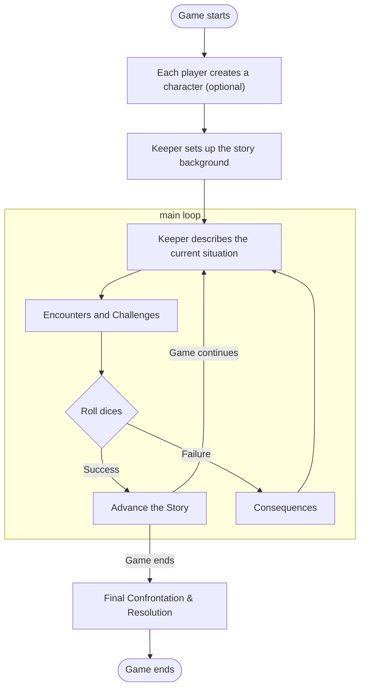
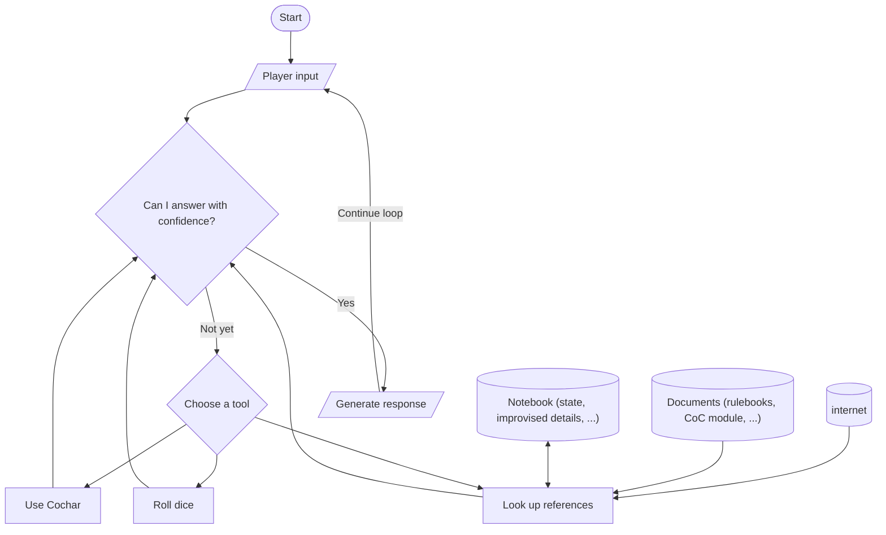

#  CoCai

[](https://github.com/psf/black)
[](https://github.com/pre-commit/pre-commit)

A chatbot that plays Call of Cthulhu (CoC) with you, powered by AI.


_(Logo by [@Norod78](https://linktr.ee/Norod78), originally [published on Civitai](https://civitai.com/images/1231343))_

## Demo

Check out this transcript:


In the first message, I asked Cocai to generate a character for me:

> Can you generate a character for me? Let's call him "Don Joe". Describe what kind of guy he is, then tabulate his stats.

Under the hood, Cocai used [Cochar](https://www.cochar.pl/). In the first couple of attempts, Cocai forgot to provide some required parameters. Cocai fixed that problem and successfully generated a character profile from Cochar.

Then, I asked Cocai what I -- playing the character of Mr. Don Joe -- can do, being stuck in a dark cave. It suggested a couple of options and described the potential outcomes associated with each choice.

I then asked Cocai to roll a skill check for me, Spot Hidden. Based on the chat history, Cocai was able to recall that Mr. Joe had a Spot Hidden skill of 85%. It rolled the dice, got a successful outcome, and took some inspiration from its 2nd response to progress the story.

Thanks to the chain-of-thought (CoT) visualization feature, you can unfold the tool-using steps and verify yourself that Cocai was indeed able to recall the precise value of Joe's Spot Hidden skill:


## Usage

### Pre-requisites

Bring your own large language model (LLM).
- The easiest (and perhaps highest-quality) way would be to provide an API key to OpenAI. Simply add `OPENAI_API_KEY=sk-...` to a `.env` file in the project root.
- With the absence of an OpenAI API key, the chatbot will default to using [Ollama](https://ollama.com/download), a program that serves LLMs locally.
  - Ensure that your local Ollama server has already downloaded the `llama3.1` model. If you haven't (or aren't sure), run `ollama pull llama3.1`.
  - If you want to use a different model that does not support function-calling, that's also possible. Revert [this commit][tc], so that you can use the ReAct paradigm to simulate function-calling capabilities with a purely semantic approach.

[tc]: https://github.com/StarsRail/Cocai/commit/13d777767d1dd96024021c085247525ec52b79ba

Install [`just`](https://github.com/casey/just), a command runner. I use this because I always tend to forget the exact command to run.

Written in Python, this project uses the Rust-based package manager [`uv`](https://docs.astral.sh/uv/). It does not require you to explicitly create a virtual environment.

**Prepare a CoC module**. Unsure which to pick? Start with [_“Clean Up, Aisle Four!”_][a4] by [Dr. Michael C. LaBossiere][mc].
You'll need it in Markdown format, though. If you can only find the PDF edition, you can:
1. upload it to Google Drive,
2. open it with Google Docs,
3. download it as Markdown, and finally
4. do some cleanings.

[a4]: https://shadowsofmaine.wordpress.com/wp-content/uploads/2008/03/cleanup.pdf
[mc]: https://lovecraft.fandom.com/wiki/Michael_LaBossiere

### Running the Chatbot

You can start the chatbot by running:

```shell
just serve
```

# Let's write an AI Keeper for _Call of Cthulhu_!

## Introduction

**Call of Cthulhu** (CoC) is a tabletop role-playing game based on the works of H.P. Lovecraft. It involves 3~8 players, but coordinating everyone's schedule can feel like trying to align the stars. That's where an AI Keeper comes in. It can run a game for you, anytime, anywhere.

In this post, we'll build a chatbot that acts as the game master ("Keeper") in a single-player CoC game. It will narrate the story, play the NPCs, and roll the dices. This means:

- **We'll use large language models (LLMs).** As a narrative-driven game, CoC involves lots of natural-language interactions. Often, the game master ("Keeper" in the CoC world) has to improvise the story based on the players' actions, which demands latent knowledge and common sense. This is where LLMs shine.
- **The chatbot will be agentic.** As the Keeper, our AI needs to consult the rulebook, roll dices, and examine player statuses. Each of those capabilities can be delegated to a "tool" that the AI can use. The ability to use tools, in this context, is called "having agency".
- **We'll use retrival-augmented generation (RAG).** While hosting the game, the AI Keeper often need to look up rules, consult playbooks, and even searching the internet for facts. We can't possibly train an LLM on all that knowledge (or guarantee its accuracy in recalling anything). Instead, we'll have the AI agent retrieve data on-demand. See [_Why RAG is Big_](https://blog.myli.page/why-rag-is-big-aa60282693dc).

Are you looking for real-world examples of building AI applications? This project is a great starting point. Let's dive in!

## Background

A typical game of CoC involves a Keeper (the game master) and Investigators (the players). The Keeper narrates the story, and the Investigators interact with the world. The Keeper also plays the roles of the non-player characters (NPCs).

How does a Keeper know how the story should unfold? That's where **CoC modules** come in. A _module_ is a scenario that the Keeper uses to run a game. It contains the story, the NPCs, and the challenges that the Investigators face.

Yes, **challenges**. CoC is a horror game, and the Investigators will face many challenges. These challenges can be anything from a locked door to a monster from another dimension. To determine the outcome of these challenges, the Keeper and the Investigators roll dice. If fortune bestows upon them, they succeed and progress the story. If not, they face the consequences, and the story takes a darker turn.

Here's a flowchart of a typical CoC game:



Now, let's examine each component in detail and see how we want to implement them.

## Design

**Character building** is a process that involves quite some math, which isn't LLM's strong suit. Fortunately, there is a Python package for that: [Cochar](https://www.cochar.pl/) by Adam Walkiewicz. We can simply register it as a tool for our AI Keeper to use.

Another math-heavy part is **dice rolling**. Researchers [have shown][sp] that LLMs tend to be biased when generating random numbers. Let's delegate this task to a tool written in traditional programming code.
For dice outcomes, the CoC rulebook has [an exact mapping][em] for numerical values to _degrees of success_ (success, fail, fumble, etc.). Things like this should also be handled by traditional code and packaged into a tool.

[sp]: https://people.csail.mit.edu/renda/llm-sampling-paper
[em]: https://cthulhuwiki.chaosium.com/rules/game-system.html#skill-rolls-and-difficulty-levels

**Storytelling** is the fun part. Our AI Keeper should be faithful to the module's story and follow the rules. This means we should give the chatbot a tool for **looking up details from the module or the rulebook**. We can prepare both documents beforehand in some parser-friendly format.

In case the Keeper needs to improvise, a similar tool should be available for **searching the internet**. There are search engines built specifically for LLMs to use via API calls, such as [Tavily](https://tavily.com/). If you prefer some wider-adopted search engine, that's easy, too: Popular RAG frameworks like [LlamaIndex][li] have integrations for big names like [Google][gg] and [Bing][bn].

[li]: https://www.llamaindex.ai/
[gg]: https://llamahub.ai/l/tools/llama-index-tools-google
[bn]: https://llamahub.ai/l/tools/llama-index-tools-bing-search

A final data source to consider may be its own **notebook**. This alleviates the problem if your chatbot tend to miss details previously appeared in the conversation, perhaps due to a short context window in your LLM of choice. We can invite the LLM to track with it the status of characters, branching storylines, and improvised details. Unlike the tools we've designed so dar, this capability should be broken down into two parts: one for taking notes and another for reading them.

Apart from function-calling tools and data-retrieving tools, let's spice it up with some LLM-powered tools. For example, a player may feel disoriented and ask the Keeper, "What can I do in this dark cave?" A generic chatbot may say something like, "You can explore the cave or go back." But a good Keeper should suggest some skills appropriate for the situation and forecast the possible outcomes. We can have a tool that generates such recommendations.

With the components translated into tools, we can now design the chatbot's workflow:


